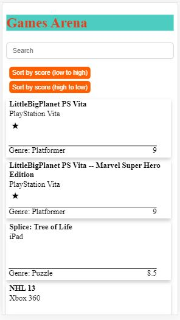
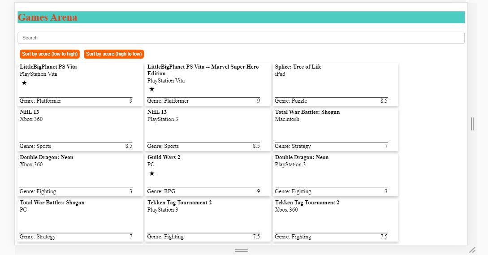

# GamesArena

This project was generated with [Angular CLI](https://github.com/angular/angular-cli) version 7.3.1.

**Front-end live demo:** https://hars1130.github.io/games-arena/

**Preview:**
* mobile:
* 
* pc:
* 

**To run on local machine:**
* Download the project and open its directory in the terminal.
* `npm install` to install dependencies.
* `ng serve` to start the server.
